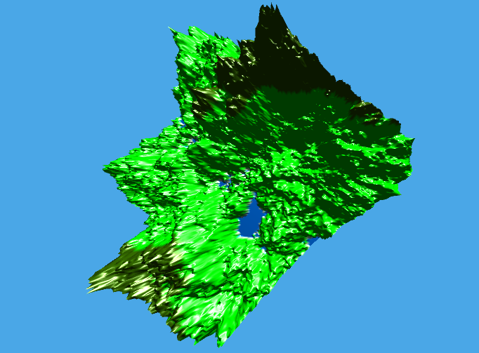

COMP30019-P1
============



> Note: This is an _extremely_ old and unpolished application. New code for the same purpose would look very different.

Project 1 for Graphics and Interaction

Build
-----

Simply clone the project and import ProjectFiles into Unity. Make sure you import the actual scene into the project
editor. When you press play, a random terrain will be generated and you will be placed into the scene. Use your mouse
and WASD to move around, and E and Q to "roll" the camera.

Description
-----------

This Unity project includes a randomly generated terrain with variable-height shading, and a day-night cycle using a
sun.

We originally used the diamond-square algorithm to generate a mesh which was then rendered, but we swapped to using a
terrain object and generating a heightmap with diamond-square instead. The heightmap is created first in the
diamondSquareAlgorithm script, then the terrain object uses this data to be initialised and transformed into the
correct shape in the initTerrain script.

To achieve varying colours for the terrain, the vertex shader used on the terrain was edited to set the colour of each
vertex depending to a predefined rgba value depending on its vertical displacement.

The sun is a PointLight object (from the tutorials) and a sphere, which has a yellow self-illuminating material
attached. This PointLight is referenced by the terrainLighting script, which feeds the the position and colour data
from the sun to the shader on the material placed on the terrain (MyMountain.mat). This allows the shader to correctly
illuminate and render the terrain based on the sun's location (using the Phong illumination model). 

Attribution
-----------

- Phong shader adapted from SharpDX - Alexandre Mutel, 2010-2012 (the one from our tutorials).
- Diamond Square algorithm adapted from Robert Stivanson on
  [GitHub](https://github.com/RobertStivanson/Unity-Diamond-Square/blob/master/src/DiamondSquare.cs).
- Skybox assets downloaded from [the Asset Store](https://www.assetstore.unity3d.com/en/#!/content/18353).

Note
----

There is an error in Unity that goes as follows:

```cs
Unknown Mixed bake mode in LightModeUtil.MapSettings()
UnityEditor.DockArea:OnGUI()
```

It does not affect the running of the application and therefore we will ignore it. It is most likely due to limited
backwards compatibility from Unity 2017 to Unity 5.6.2f1.
